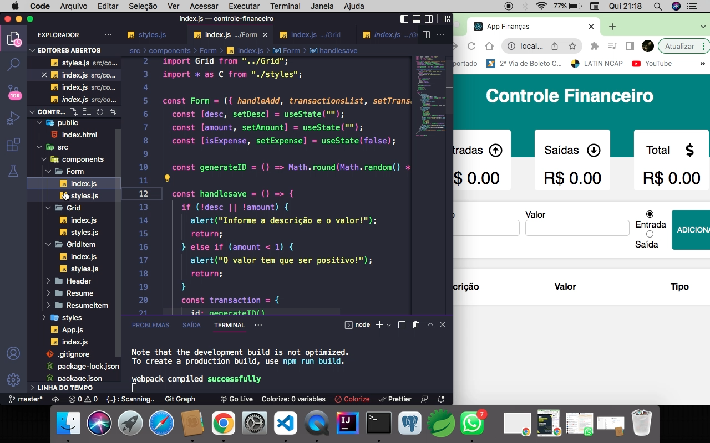
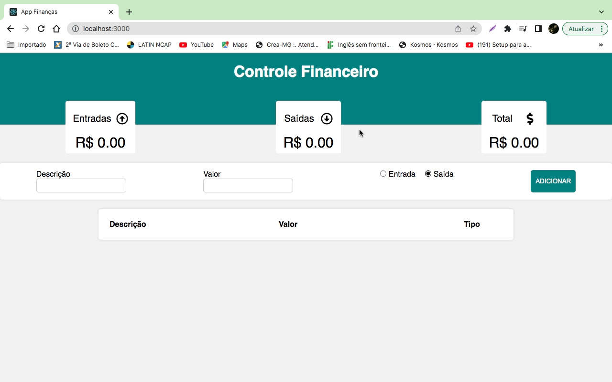

## Controle de finanças:
💻 Projeto:</br></br>
Um CRUD em ReactJS, como o usuário pode adicionar e deletar informações no controle de finanças pessoal, e seu armazenamento é feito pelo Localstorage(Banco local do navegador).</br> </br>
🔖 Layout</br></br>

</br> </br>

</br> </br>

## :globe_with_meridians: Tecnologias

Esse projeto foi desenvolvido com as seguintes tecnologias:


 

## :wrench: Como Utilizar
```bash
# Clonando esse repositório
$ git clone https://github.com/chagasleandro/Controle-Financas
```

## Servidor de desenvolvimento

Execute `npm start` para um servidor dev. Navegue até `http://localhost:3000/`. O aplicativo será recarregado automaticamente se você alterar qualquer um dos arquivos de origem.
# Instalando as dependências
$ npm init
